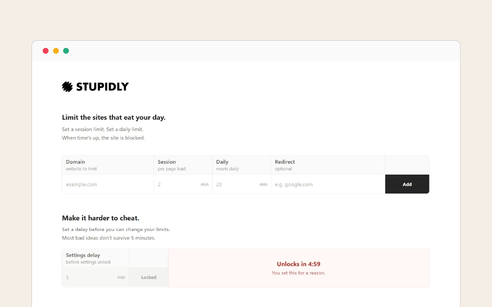

  
  

  

  

  

## Description

STUPIDLY is a simple Chrome extension for limiting time on distracting websites.

I built it because too many website blockers make a simple job way more complicated than it needs to be.
This extension does one thing: it limits distracting websites.
Set a session limit. Set a daily limit. When time runs out, the site is blocked.
Want to make it harder to cheat? Add a delay before you can change your limits.
Most bad ideas don’t survive 5 minutes.
No account. No ads. No analytics. Your limits and usage stay locally in Chrome.
No dashboards. No schedules. No fake productivity.

Just install it, set your limits, and get on with your day.

## Get it now

Chrome Web Store — coming soon.

## Privacy

No ads. Your limits and usage stay locally in your browser. [Read the privacy policy](PRIVACY.md)

## Feedback

Found a bug or got an idea? [Open an issue](https://github.com/coenclaassen/stupidly/issues).

## License

Free for noncommercial use under the [PolyForm Noncommercial 1.0.0](LICENSE) license.
